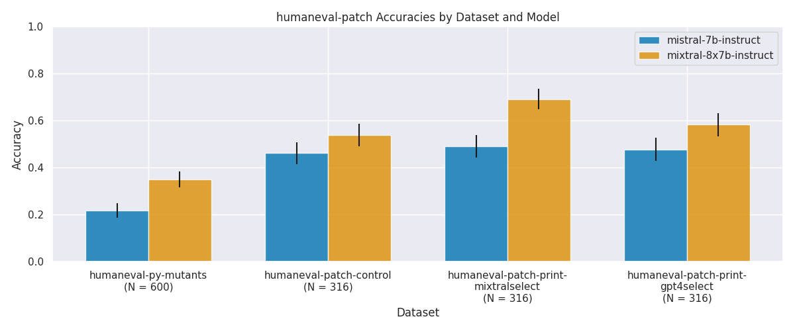

# print-llama

In this repository, we investigate language models' ability to utilize print statements to patch buggy code. The experiment has three stages:
1. Procedurally generate bugs in Python code using abstract syntax trees (ASTs).
2. Insert useful print statements and simulated outputs in the buggy solutions few-shot using GPT-4.
3. Evaluate language models' repair accuracy on both the control- (no print) and print- conditions of the data.

To reproduce the following figure:
- Create an empty conda environment and run ```pip install -e .``` in the ```printllama``` root directory to complete the required setup
- Produce buggy solutions using ```python experiments/humaneval-patch/ast/produce_perturbations.py```
- Generate many print insertions per problem using ```python experiments/humaneval-patch/print-insertions/print-insertion.py model=gpt4```
- Let both GPT-4 and [mistralai/Mixtral-8x7B-v0.1](https://huggingface.co/mistralai/Mixtral-8x7B-v0.1) choose which prints are most useful per problem using:

```python experiments/humaneval-patch/print-insertions/eval_and_select.py model=gpt4 data=humaneval-patch-gpt4-prints-exploded``` 

```torchrun --nproc_per_node 2 experiments/humaneval-patch/print-insertions/eval_and_select.py model=mixtral-8x7b-instruct-vllm data=humaneval-patch-gpt4-prints-exploded```

- Evaluate each of [mistralai/Mistral-7B-Instruct-v0.2](https://huggingface.co/mistralai/Mistral-7B-Instruct-v0.2)'s and [mistralai/Mixtral-8x7B-v0.1](https://huggingface.co/mistralai/Mixtral-8x7B-v0.1)'s accuracies using a batch script:
  ```sbatch experiments/humaneval-patch/scripts/humaneval-patch-eval-all.sh```

- Produce the figure using ```python experiments/humaneval-patch/plot_mistrals.py```



We find that [mistralai/Mixtral-8x7B-v0.1](https://huggingface.co/mistralai/Mixtral-8x7B-v0.1) likely only benefits from prints by chance, when given a selection round to pre-select its most preferred helpful print insertions per problem.

See the ```humaneval-patch``` dataset on the HuggingFace dataset hub [here](https://huggingface.co/datasets/scandukuri/humaneval-patch).
